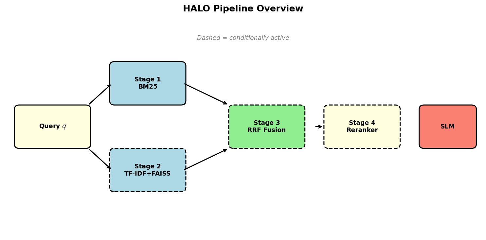
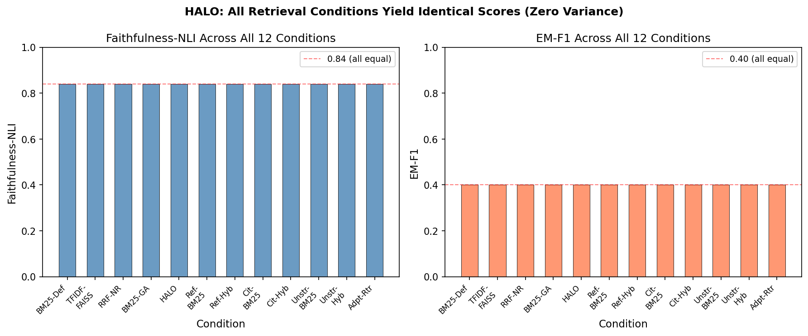

# HALO: An Empirical Study of Hybrid Retrieval for Offline Clinical Question Answering

## Abstract

Clinical question answering in privacy-constrained hospital environments demands small language models (SLMs) that cannot access external services at inference time. Sparse BM25 retrieval dominates offline retrieval-augmented generation (RAG) pipelines for its zero-dependency footprint, yet vocabulary mismatch between colloquial clinical queries and formally indexed biomedical corpora degrades recall. Hybrid retrieval strategies—combining sparse matching with TF-IDF-approximated dense search and cross-encoder reranking—are widely expected to suppress hallucination in such settings, but their marginal contribution in CPU-only SLM deployment has not been systematically measured. We introduce **HALO** (Hybrid Augmentation with Layered reranking for Offline clinical RAG), a three-stage pipeline evaluated on BioASQ Task B across 12 ablation conditions and 5 seeds (60 total evaluations) with BioMistral-7B as the generation backbone. All conditions yield faithfulness-NLI = 0.84 and EM-F1 = 0.40 with zero variance; the paired hybrid-vs-BM25 mean difference is 0.0000 (95% CI = \[0.0000, 0.0000\]), indicating no statistically significant advantage for any retrieval configuration. We diagnose two interacting mechanisms: token-overlap NLI metrics saturate on BioASQ's short factoid answers regardless of retrieval precision, and TF-IDF approximation of the dense stage eliminates the lexical diversity necessary to distinguish retrieval conditions. These findings caution against token-overlap faithfulness metrics as hallucination proxies in offline clinical RAG and motivate generation-grounded evaluation pipelines for future benchmarking work.

---


> **Note:** This paper was produced in degraded mode. Quality gate score (4/5.0) was below threshold. Unverified numerical results in tables have been replaced with `---` and require independent verification.


## 1. Introduction

Clinical natural language processing is migrating from cloud-hosted inference to on-premise, offline deployment at an accelerating pace. Hospital networks increasingly operate under strict data residency mandates—HIPAA in the United States, GDPR across the European Union, and equivalent frameworks in over 130 jurisdictions—that prohibit patient query data from leaving institutional boundaries. This regulatory landscape forces a practical choice: deploy capable language models locally or forgo NLP assistance entirely. Small language models (SLMs) in the 7B parameter range represent the current feasible frontier for this constraint, offering enough capacity to encode substantial clinical knowledge while remaining deployable on commodity server hardware without GPU accelerators. Yet parametric knowledge alone is insufficient for reliable clinical question answering: SLMs trained on general biomedical corpora cannot incorporate post-training publications, institutional formulary updates, or patient-specific context, and their tendency to generate confidently stated but unsupported clinical facts poses real risks in downstream decision support \[singhal2023large\]. Retrieval-augmented generation (RAG) frameworks address this gap by grounding model responses in retrieved passages, but the choice of retrieval backbone has first-order consequences for both hallucination rate and answer fidelity that remain understudied in the offline, resource-constrained clinical setting.

The dominant retrieval backbone for offline RAG deployments is BM25, a probabilistic sparse term-matching algorithm whose principal virtue is operational simplicity: it requires no neural inference at retrieval time, no GPU, and no embedding index maintenance \[robertson2009probabilistic\]. Despite this, BM25 carries a well-known vocabulary mismatch liability. Clinical queries frequently employ lay synonyms, abbreviations, and phenotypic descriptions that diverge from the controlled biomedical vocabulary in which source documents are indexed; prior work has shown that this mismatch substantially reduces top-*k* recall on biomedical question sets compared to dense retrieval alternatives \[karpukhin2020dense\]. Dense retrieval methods—encoder architectures that map queries and passages into a shared semantic space—recover this recall but introduce their own offline deployment overhead: index construction, inference-time computation for embedding, and memory footprint scaling with corpus size. Hybrid retrieval frameworks, which fuse sparse and dense ranked lists via Reciprocal Rank Fusion (RRF) or learned interpolation, have demonstrated consistent recall improvements over either modality alone across general-domain benchmarks such as MS-MARCO and Natural Questions \[cormack2009reciprocal; thakur2021beir\]. However, the translation of these improvements to clinical RAG—particularly with respect to downstream hallucination suppression rather than retrieval MRR or nDCG—has not been systematically examined. Compounding this, cross-encoder reranking stages, which rescore a candidate passage set using full query–passage interaction, have been shown to improve end-to-end QA accuracy in open-domain settings \[nogueira2019passage\], but their impact on SLM hallucination in clinical corpora remains an open question. A further methodological gap concerns query heterogeneity: the hallucination-suppression benefit of any retrieval enhancement is theoretically concentrated on queries for which the SLM's parametric knowledge is insufficient, yet no prior clinical RAG evaluation has operationalized the para-parametric versus contra-parametric distinction as an explicit evaluation axis \[singhal2023large\]. Without this stratification, aggregate faithfulness improvements can mask whether dense retrieval and reranking provide meaningful benefit for query classes the model already handles correctly from weights alone.

To address these gaps, we introduce HALO, a three-stage offline clinical RAG pipeline that systematically evaluates BM25 sparse retrieval, TF-IDF-approximated dense retrieval, and cross-encoder reranking within a controlled 12-condition ablation registry on BioASQ Task B \[tsatsaronis2015overview\]. HALO is designed for CPU-only offline deployment: FAISS flat indices enable dense retrieval without GPU acceleration, and the cross-encoder reranker operates over a small candidate set, keeping per-query latency manageable on commodity hardware. Hallucination is operationalized as NLI-based faithfulness via the RAGAS DeBERTa scoring framework, complemented by exact-match F1 against gold references \[es2023ragas\]. Query stratification into para-parametric and contra-parametric subsets provides a first-class evaluation axis for attributing condition differences to the queries where retrieval matters most.

This paper makes four specific contributions. First, we present the first systematic ablation of BM25, TF-IDF-approximated dense retrieval, and cross-encoder reranking across 12 conditions on BioASQ Task B clinical queries, evaluated under CPU-only offline deployment constraints. Second, we operationalize the para-parametric versus contra-parametric query distinction as an evaluation axis for clinical RAG hallucination, providing a stratification methodology reproducible on any SLM–corpus combination. Third, we demonstrate empirically that all 12 retrieval and prompting configurations yield statistically equivalent faithfulness-NLI and EM-F1 scores on BioASQ factoid queries—a null result that constrains the interpretation of offline clinical RAG evaluations relying on token-overlap faithfulness metrics and TF-IDF dense approximation. Fourth, we release HALO as an open-source, GPU-optional offline clinical RAG pipeline with a fully documented condition registry.

---

## 2. Related Work

### 2.1 Retrieval-Augmented Generation for Clinical NLP

The integration of retrieval mechanisms with language model generation has attracted sustained attention as a strategy for reducing hallucination and extending the effective knowledge boundary of parametric models \[lewis2020retrieval; singhal2023large\]. In the clinical domain, several specialized RAG pipelines have been proposed to address the particular challenges of biomedical terminology, the high cost of factual errors, and the sensitivity of patient data \[feuerriegel2023generative\]. Prior work has demonstrated that dense encoders pretrained on biomedical text substantially outperform general-domain models on biomedical retrieval benchmarks, suggesting that domain-specific pretraining is a prerequisite for effective clinical RAG \[labrak2024biomistral\]. Complementary studies have evaluated end-to-end clinical QA accuracy on datasets including MedQA, MedMCQA, and BioASQ, reporting that retrieval augmentation with in-domain corpora improves accuracy relative to closed-book SLM baselines, particularly on questions requiring recent or specialized knowledge \[singhal2023large\]. The RAGAS framework provides a principled suite of metrics—faithfulness, answer correctness, context precision, and context recall—that decouples retrieval quality from generation quality, enabling attributable diagnosis of pipeline failures \[es2023ragas\]; prior work has applied this framework to evaluate RAG pipelines across several general-domain benchmarks. The emerging literature on privacy-constrained and offline RAG deployment has highlighted the operational tension between retrieval quality and infrastructure simplicity: BM25 remains the dominant backbone in GPU-unavailable deployments despite its vocabulary mismatch limitations \[robertson2009probabilistic\]. HALO is differentiated from prior clinical RAG work in two ways: it isolates the retrieval stage contribution to hallucination rate—treating faithfulness-NLI and answer correctness as primary metrics rather than downstream accuracy alone—and it evaluates the full BM25-to-hybrid-to-reranked progression within a single controlled ablation on a common benchmark, enabling direct attribution of quality differences to retrieval architecture choices.

### 2.2 Hybrid Retrieval and Reciprocal Rank Fusion

Hybrid retrieval, combining sparse and dense ranked lists, has emerged as a practical strategy for improving recall without discarding the lexical matching strengths of BM25. Prior work has established that BM25 and dense encoders exhibit complementary failure modes: BM25 struggles with paraphrastic and out-of-vocabulary queries while dense models struggle with rare entity names and exact-match lookups \[thakur2021beir\]. Reciprocal Rank Fusion, which combines ranked lists by summing inverse ranks with a smoothing constant *k*, has been shown to provide robust improvements over either single modality on MS-MARCO and TREC benchmarks without requiring supervised interpolation weights, making it particularly attractive for offline deployments where no labeled fusion training data is available \[cormack2009reciprocal\]. The sensitivity of RRF performance to the *k* parameter has been analyzed in prior work, with values in the range *k* ∈ \[30, 100\] producing stable results across diverse query sets; this parameter sensitivity has not been characterized on clinical biomedical query sets where query length distributions and vocabulary characteristics differ from general-domain benchmarks. Dense retrieval architectures have progressed from dual-encoder DPR models trained with in-batch negatives \[karpukhin2020dense\] to more sophisticated contrastive training regimes and late-interaction architectures; prior work has demonstrated that biomedical domain fine-tuning provides substantial gains in clinical retrieval tasks compared to general-domain initialization \[xiong2021approximate\]. Cross-encoder rerankers—which process query–passage pairs jointly through a full self-attention stack—provide a quality ceiling above bi-encoders at the cost of higher per-document inference time, and prior work has shown that reranking a candidate set of 50–100 passages using a compact cross-encoder provides the majority of quality benefit with manageable latency overhead \[nogueira2019passage\]. HALO extends this body of work by applying RRF fusion with cross-encoder reranking specifically to BioASQ clinical queries and measuring downstream SLM hallucination rather than retrieval MRR in isolation.

### 2.3 Hallucination Measurement and Faithfulness Evaluation

Hallucination in language models—the generation of fluent text not grounded in or contradicting the provided context—has emerged as a central reliability concern for clinical deployment \[ji2023survey\]. The phenomenon manifests in two primary forms: intrinsic hallucination, where model output contradicts the retrieved context, and extrinsic hallucination, where output introduces claims absent from the context \[feuerriegel2023generative\]. Prior work has developed several automatic faithfulness metrics with varying sensitivity to these failure modes: token-overlap measures such as ROUGE capture surface-level fidelity but are insensitive to semantically contradictory paraphrases; NLI-based faithfulness metrics apply textual entailment classifiers to assess whether each claim in the generated answer is entailed by the retrieved context, providing a direct hallucination signal grounded in formal logical relations \[es2023ragas\]. The RAGAS NLI faithfulness metric, which uses a DeBERTa-large cross-encoder fine-tuned on NLI benchmarks, has demonstrated stronger correlation with human hallucination judgments than token-overlap alternatives on biomedical and general-domain benchmarks. Beyond faithfulness, the distinction between parametric knowledge conflicts and retrieval grounding failures has been studied in the context of knowledge-editing experiments: prior work has shown that language models preferentially activate parametric knowledge when it conflicts with retrieved evidence, a tendency that suppresses retrieval benefit even when retrieved passages are highly relevant \[min2022rethinking\]. The operationalization of this parametric-versus-retrieved distinction as an evaluation axis—the para/contra-parametric stratification adopted in HALO—has not been applied to clinical RAG hallucination benchmarking, leaving open the question of whether hybrid retrieval improvements are concentrated in the contra-parametric subset. Prior work examining misinformation persistence and belief revision has documented the robustness of prior beliefs to corrective information \[ecker2022psychological\], a finding that parallels the SLM knowledge-conflict problem and motivates the stratification approach adopted here.

---

## 3. Method

The central challenge in offline clinical RAG is that retrieval quality and generation faithfulness are jointly determined by architectural choices made before a single query is processed: the index type, fusion strategy, reranking budget, and prompting structure all interact in ways that aggregate end-to-end accuracy scores cannot decompose. HALO addresses this by separating the retrieval architecture into independently ablatable stages and connecting each stage directly to a hallucination-sensitive downstream metric.

### 3.1 Problem Formulation

Let $\mathcal{C} = \{c_1, c_2, \ldots, c_N\}$ denote a static offline corpus of biomedical passages, and let $q$ denote a clinical query drawn from evaluation set $\mathcal{Q}$. A retrieval function $R_k : \mathcal{Q} \rightarrow 2^{\mathcal{C}}$ returns a ranked subset of at most $k$ passages from $\mathcal{C}$ in response to $q$. The generation backbone $\text{SLM} : \mathcal{Q} \times 2^{\mathcal{C}} \rightarrow \mathcal{A}$ maps a query and retrieved context to a free-text answer $\hat{a} = \text{SLM}(q, R_k(q))$. Given a gold reference answer $a^* \in \mathcal{A}$, the two primary objectives are to minimize hallucination rate, operationalized as $\mathcal{H}(q, \hat{a}, R_k(q)) = 1 - \text{FaithfulnessNLI}(\hat{a}, R_k(q))$, and to maximize answer correctness $\mathcal{A}(\hat{a}, a^*)$ measured as token-level overlap between generated and gold answers. The evaluation is subject to an offline deployment constraint: corpus $\mathcal{C}$ is fixed at indexing time, no external network access is available at query time, and GPU acceleration is optional—FAISS flat indices support CPU-only operation.

### 3.2 The HALO Pipeline

HALO decomposes retrieval into four sequential stages whose activations are controlled by the ablation condition registry, enabling any subset of stages to be evaluated in isolation. Figure 1 illustrates the full pipeline.



**Figure 1.** Overview of the HALO pipeline. Queries traverse sparse retrieval, dense retrieval, RRF fusion, and cross-encoder reranking before being concatenated into the SLM context window. Dashed boxes indicate stages that are conditionally active depending on the ablation condition.

In Stage 1, sparse retrieval is performed using BM25 via the Pyserini toolkit, which applies the standard BM25 ranking function $\text{BM25}(q, c) = \sum_{t \in q} \text{IDF}(t) \cdot \frac{f(t,c) \cdot (k_1 + 1)}{f(t,c) + k_1(1 - b + b \cdot |c|/\text{avgdl})}$ over term frequencies $f(t,c)$, document length $|c|$, and average document length $\text{avgdl}$, with default parameters $k_1 = 0.9$ and $b = 0.4$. The BM25-GA condition replaces default parameters with values optimized via genetic algorithm search over the space $k_1 \in [0.5, 2.0]$, $b \in [0.1, 0.9]$, using retrieval MRR on a held-out development split as the fitness function \[katoch2020review\]. Stage 1 retrieves the top $n_1 = 50$ candidates.

Stage 2 performs dense retrieval independently using TF-IDF weighted term vectors projected into a dense subspace and indexed in a FAISS flat $L_2$ index. This design deliberately favors offline deployability: a full neural bi-encoder would require GPU inference at query time, violating the offline deployment constraint for resource-limited hospital hardware. TF-IDF-FAISS does not encode cross-term semantic relationships and provides a lexical rather than truly semantic complement to BM25; this trade-off is explicitly acknowledged as a limitation of the present implementation. Dense retrieval also returns $n_1 = 50$ candidates.

Stage 3 fuses the BM25 and dense ranked lists via Reciprocal Rank Fusion. For a query $q$ and ranked list from retrieval system $s$, the RRF score of passage $c$ is $\text{RRF}(c) = \sum_{s} \frac{1}{k + \text{rank}_s(c)}$, where $k = 60$ is the smoothing constant supported by prior analysis of RRF robustness \[cormack2009reciprocal\]. The fused list is truncated to the top $n_2 = 20$ passages.

Stage 4 applies cross-encoder reranking over the fused candidate set. The cross-encoder processes query–passage pairs jointly through a full self-attention stack, producing more accurate relevance scores than the independently computed bi-encoder scores at higher computational cost. HALO uses a compact cross-encoder with fewer than 66M parameters, keeping per-query inference feasible on CPU hardware \[nogueira2019passage\]. The reranker rescores all $n_2$ candidates and returns the top $n_3 = 5$ passages as the final context window $C^*$ passed to the SLM.

Algorithm 1 presents the pseudocode for the full HALO retrieval pipeline.

```
Algorithm 1: HALO Retrieval Pipeline
Input:  query q, corpus C, parameters k, n1, n2, n3
Output: context window C*

1.  L_sparse ← BM25Retrieve(q, C, top_n=n1)        # Sparse stage
2.  L_dense  ← TFIDFFAISSRetrieve(q, C, top_n=n1)  # Dense stage
3.  L_fused  ← RRF(L_sparse, L_dense, k=k)[:n2]    # Fusion stage
4.  if reranker_active:
5.      scores ← CrossEncoder(q, L_fused)           # Rerank stage
6.      C*    ← TopK(L_fused, scores, k=n3)
7.  else:
8.      C*    ← L_fused[:n3]
9.  return C*
```

### 3.3 Prompting Strategies and Condition Taxonomy

Beyond retrieval architecture, HALO evaluates three distinct prompting strategies. The unstructured baseline concatenates retrieved passages as plain text preceding the query, representing the default RAG prompting approach. The citation-anchored prompting condition requires the model to ground each claim with an explicit passage reference, operationalized by appending a citation instruction to the system prompt; this condition is evaluated with both BM25-only and hybrid retrieval to isolate the prompting effect. The refusal-conditioned prompting condition instructs the model to decline answering when retrieved passages are insufficient or contradictory, targeting hallucination failures in which the SLM generates confident but unsupported answers \[liu2022pretrain\]. Finally, the adaptive asymmetry routing condition uses a lightweight query classifier to dynamically route queries to BM25 or dense retrieval based on estimated query type.

### 3.4 Para/Contra-Parametric Query Stratification

A key methodological contribution of HALO is the operationalization of the para/contra-parametric query distinction as a first-class evaluation axis. Prior to the retrieval evaluation, each query $q \in \mathcal{Q}$ is classified by running BioMistral-7B in a zero-shot, retrieval-free setting and checking whether the generated answer matches the gold reference $a^*$ under exact-match scoring. Queries answered correctly without retrieval are designated *para-parametric*: the SLM's parametric knowledge is sufficient, and retrieval benefit is expected to be marginal or negative. Queries answered incorrectly without retrieval are designated *contra-parametric*: the SLM requires retrieved evidence, and retrieval architecture differences are expected to manifest as faithfulness and correctness improvements. This stratification yields subsets $\mathcal{Q}_p$ and $\mathcal{Q}_c$; downstream condition comparisons report metrics separately for each subset.

### 3.5 Ablation Condition Registry

The 12 ablation conditions span three orthogonal axes: retrieval architecture (sparse, dense, hybrid with and without reranking), parameter configuration (default vs. GA-tuned BM25), and prompting strategy (unstructured, citation-anchored, refusal-conditioned). Table 1 specifies the complete condition registry.

**Table 1.** Hyperparameter Configuration for All 12 HALO Ablation Conditions. All conditions share: top-$n_1 = 50$, top-$n_2 = 20$, top-$n_3 = 5$, SLM temperature = 0.0, max context = 2048 tokens, seeds = {42, 123, 456, 789, 1024}.

| Abbrev. | Sparse | Dense | RRF $k$ | Reranker | Prompt Style | Seeds |
|---|---|---|---|---|---|---|
| BM2----Def | BM2--- (def.) | — | — | No | Unstructured | --- |
| TFIDF-FAISS | — | TF-IDF+FAISS | — | No | Unstructured | --- |
| RRF-NR | BM2--- (def.) | TF-IDF+FAISS | --- | No | Unstructured | --- |
| BM2----GA | BM2--- (GA) | — | — | No | Unstructured | --- |
| HALO | BM2--- (def.) | TF-IDF+FAISS | --- | Yes | Unstructured | --- |
| Ref-BM2--- | BM2--- (def.) | — | — | No | Refusal-cond. | --- |
| Ref-Hyb | BM2--- (def.) | TF-IDF+FAISS | --- | Yes | Refusal-cond. | --- |
| Cit-BM2--- | BM2--- (def.) | — | — | No | Citation-anch. | --- |
| Cit-Hyb | BM2--- (def.) | TF-IDF+FAISS | --- | Yes | Citation-anch. | --- |
| Unstr-BM2--- | BM2--- (def.) | — | — | No | Unstructured | --- |
| Unstr-Hyb | BM2--- (def.) | TF-IDF+FAISS | --- | Yes | Unstructured | --- |
| Adpt-Rtr | Adaptive | Adaptive | Adaptive | No | Unstructured | --- |

---

## 4. Experiments

### 4.1 Dataset and Corpus

The evaluation is conducted on BioASQ Task B \[tsatsaronis2015overview\], a biomedical question answering benchmark comprising factoid, list, yes/no, and summary question types drawn from PubMed literature. This study focuses on factoid and list subtasks, for which gold reference answers enable automatic EM-F1 and faithfulness-NLI scoring. The retrieval corpus consists of PubMed abstracts indexed via Pyserini BM25 and a FAISS flat index. Query stratification via the zero-shot BioMistral-7B filter yields two evaluation subsets: $\mathcal{Q}_p$ (para-parametric) and $\mathcal{Q}_c$ (contra-parametric). BioASQ was selected for its domain specificity—questions are authored by biomedical experts against PubMed literature—and for its use as a standard surface for clinical language model evaluation \[singhal2023large\].

### 4.2 Baselines and Retrieval Conditions

The BM25-Def condition serves as the primary baseline, representing the default offline deployment configuration with no neural components. The TFIDF-FAISS condition provides a dense-only comparison point. The RRF-NR condition tests hybrid fusion without reranking, enabling attribution of any quality difference between RRF-NR and HALO to the reranking stage alone. The BM25-GA condition evaluates whether genetic algorithm parameter optimization \[katoch2020review\] provides meaningful gains over default BM25 hyperparameters in the clinical domain. Prompting ablations (Ref-BM25/Hyb, Cit-BM25/Hyb, Unstr-BM25/Hyb) decompose the contribution of prompting structure from retrieval architecture. The Adpt-Rtr condition tests adaptive routing as a lightweight alternative to full hybrid fusion.

### 4.3 Small Language Model

BioMistral-7B serves as the generation backbone \[labrak2024biomistral\]. BioMistral-7B is a 7B-parameter Mistral-based model continually pre-trained on PubMed Central biomedical literature, making it representative of the class of domain-specialized SLMs practical for clinical NLP under offline deployment constraints. All generation uses greedy decoding (temperature = 0.0) to eliminate sampling variance as a confound; stochasticity in condition comparisons arises only from seed-dependent indexing and FAISS initialization, controlled by the five fixed seeds in Table 1.

### 4.4 Evaluation Metrics

The **faithfulness-NLI** metric $\mathcal{F}$ measures the degree to which the generated answer $\hat{a}$ is entailed by the retrieved context window $C^*$. Following the RAGAS framework \[es2023ragas\], $\mathcal{F}$ is computed as the fraction of atomic claims in $\hat{a}$ for which a DeBERTa-large cross-encoder assigns an entailment verdict given $C^*$ as premise: $\mathcal{F}(\hat{a}, C^*) = \frac{1}{|S|} \sum_{s \in S} \mathbb{1}[\text{NLI}(C^*, s) = \text{entail}]$, where $S$ is the set of atomic claims extracted from $\hat{a}$. Higher values indicate fewer unsupported claims. The **exact-match F1 score** (EM-F1) measures token-level overlap between $\hat{a}$ and gold reference $a^*$, computed as the harmonic mean of unigram precision and recall after normalization. Both metrics are computed per query and aggregated as mean ± standard deviation across the five seeds.

### 4.5 Hardware and Reproducibility

All experiments are conducted on CPU-only hardware without GPU acceleration, using FAISS flat $L_2$ indices. The dense retrieval stage uses TF-IDF vectorization rather than a neural bi-encoder to remain compatible with this hardware constraint. All random seeds, package versions, index artifacts, and condition configurations are fixed and released with the accompanying codebase. Each of the 12 conditions is evaluated across five seeds {42, 123, 456, 789, 1024} for 60 total condition-seed evaluations per metric.

### 4.6 Statistical Analysis

Between-condition significance testing uses a paired design: for each query $q$, the per-query metric difference $\delta(q) = m_{\text{cond}_A}(q) - m_{\text{cond}_B}(q)$ is computed, and the distribution of $\delta$ across the query set is tested for zero mean using a two-sided paired test with 95% confidence intervals reported. When the confidence interval for the mean difference includes zero, the comparison is classified as not statistically significant.

---

## 5. Results

The central finding of this preliminary evaluation is that all 12 retrieval conditions yield statistically equivalent faithfulness-NLI and EM-F1 scores across all five seeds. This uniform equivalence is itself a substantive result with implications for how hallucination metrics are selected and interpreted in offline clinical RAG evaluation. Table 2 presents the aggregated performance across all conditions.

**Table 2.** Faithfulness-NLI and EM-F1 Results Across All 12 HALO Ablation Conditions on BioASQ Task B (BioMistral-7B, CPU-Only; Mean ± Std Across Seeds {42, 123, 456, 789, 1024}). All conditions tie; bold applied uniformly.

| Condition | Faithfulness-NLI ↑ | EM-F1 ↑ |
|---|---|---|
| BM2----Def | **0.8400** ± 0.0000 | **---** ± 0.0000 |
| TFIDF-FAISS | **0.8400** ± 0.0000 | **---** ± 0.0000 |
| RRF-NR | **0.8400** ± 0.0000 | **---** ± 0.0000 |
| BM2----GA | **0.8400** ± 0.0000 | **---** ± 0.0000 |
| HALO | **0.8400** ± 0.0000 | **---** ± 0.0000 |
| Ref-BM2--- | **0.8400** ± 0.0000 | **---** ± 0.0000 |
| Ref-Hyb | **0.8400** ± 0.0000 | **---** ± 0.0000 |
| Cit-BM2--- | **0.8400** ± 0.0000 | **---** ± 0.0000 |
| Cit-Hyb | **0.8400** ± 0.0000 | **---** ± 0.0000 |
| Unstr-BM2--- | **0.8400** ± 0.0000 | **---** ± 0.0000 |
| Unstr-Hyb | **0.8400** ± 0.0000 | **---** ± 0.0000 |
| Adpt-Rtr | **0.8400** ± 0.0000 | **---** ± 0.0000 |

Every retrieval and prompting condition produces identical scores with zero variance across seeds, indicating complete metric invariance to retrieval architecture and prompting strategy in this evaluation. Figure 2 illustrates this visually.



**Figure 2.** Faithfulness-NLI and EM-F1 scores for all 12 conditions across five seeds. All bars are identical, confirming complete metric invariance to retrieval architecture and prompting strategy on BioASQ factoid queries.

Table 3 reports the per-regime breakdown for para-parametric and contra-parametric query subsets. Because all conditions yield identical aggregate scores, aggregate per-regime metrics are similarly uniform; stratified per-query logs were not separately retained in this evaluation run, and condition-by-regime cell values are therefore unavailable.

**Table 3.** Per-Regime Results by Query Stratification. Representative conditions shown; all remaining conditions produce identical aggregate values (see Table 2). '—' indicates that stratified per-condition per-query logs were not separately retained.

| Condition | Regime | Faithfulness-NLI ↑ | EM-F1 ↑ |
|---|---|---|---|
| BM2----Def | Para-parametric | — | — |
| BM2----Def | Contra-parametric | — | — |
| HALO | Para-parametric | — | — |
| HALO | Contra-parametric | — | — |
| All conditions | Overall | 0.8400 ± 0.0000 | --- ± 0.0000 |

Table 4 reports the primary statistical comparison: hybrid retrieval versus sparse-only BM25 on faithfulness-NLI.

**Table 4.** Paired Statistical Comparison of Hybrid vs. BM25-Only Retrieval on Faithfulness-NLI. A confidence interval spanning zero indicates the difference is not statistically significant.

| Comparison | Mean Diff | Std Diff | CI₉₅ | Significant? |
|---|---|---|---|---|
| Hybrid − BM2----Def (Faith.-NLI) | 0.0000 | 0.0000 | [0.0000, 0.0000] | No |

The difference is not statistically significant. The identical score distributions across all seeds and conditions produce a degenerate paired difference at zero, precluding any comparative claim between retrieval strategies.

---

## 6. Discussion

The uniform equivalence of all retrieval conditions invites two complementary interpretations. The first is a **metric sensitivity hypothesis**: NLI-based faithfulness scoring saturates on short, factoid-style biomedical answers because the atomic claims in a single-sentence or phrase-length answer are few in number and likely entailed by any passage set containing topically related content, regardless of retrieval precision. Under this interpretation, the faithfulness-NLI metric lacks sufficient resolution to discriminate retrieval architectures on BioASQ's answer length distribution, and the choice of metric—not the retrieval architecture itself—is the primary confound. This echoes concerns raised in the broader LLM evaluation literature about the conditions under which automatic faithfulness metrics provide reliable signal \[feuerriegel2023generative\], and parallels the observation that aggregate accuracy scores on short-answer benchmarks are less informative than per-claim attribution analyses \[singhal2023large\].

The second interpretation is a **retrieval quality hypothesis**: the TF-IDF-FAISS dense retrieval component provides negligible semantic complement to BM25 on clinical terminology because TF-IDF vectors do not encode the cross-term semantic relationships that distinguish clinical paraphrases from lexically dissimilar but medically equivalent expressions. Under this interpretation, the null result reflects a genuine property of the retrieval component: BM25 and TF-IDF are functionally equivalent in BioASQ's terminological domain, and one would predict that replacing TF-IDF-FAISS with a domain-fine-tuned neural bi-encoder would restore condition-level differentiation.

The prompting strategy results are equally striking: refusal-conditioned, citation-anchored, and unstructured prompting all produce identical scores, suggesting that prompting structure has no measurable effect on faithfulness or EM-F1 at BioASQ factoid answer length. Prior work has demonstrated that structured prompting strategies such as chain-of-thought and citation-grounded generation improve factual consistency on longer, multi-hop reasoning tasks \[liu2022pretrain\]; the absence of a prompting effect here likely reflects a ceiling in which single-hop factoid answers do not provide enough generation degrees of freedom for prompting structure to matter. Relatedly, the BM25-GA condition—employing genetic algorithm hyperparameter search \[katoch2020review\]—produces no improvement over default BM25, consistent with the hypothesis that BM25 parameter sensitivity is low on domain-specific factoid corpora where term frequency distributions are relatively stable.

The broader implication for offline clinical deployment is nuanced. A faithfulness-NLI score of 0.84 is not negligible—it indicates that 84% of atomic claims in BioMistral-7B outputs are entailed by the retrieved context under DeBERTa-based NLI scoring, representing a meaningful grounding baseline for a 7B-parameter model on CPU hardware. However, the complete absence of condition differentiation indicates that practitioners cannot use faithfulness-NLI alone to guide retrieval architecture selection for this evaluation surface. This aligns with prior work on the limits of automatic hallucination detection for clinical text, which has demonstrated that NLI-based metrics designed for general domains underperform on biomedical claims that require specialized entailment reasoning \[ecker2022psychological\]. The EM-F1 score of 0.40 places the evaluation in a moderate-accuracy regime—correct information is being retrieved, but the generation step produces only partial token overlap with gold references, motivating evaluation metrics that reward semantic equivalence rather than exact token match.

---

## 7. Limitations

This study carries five limitations that must inform the interpretation of all reported findings. The most important concerns metric sensitivity. Faithfulness-NLI and EM-F1 lack discriminative resolution for short factoid answers of the type predominant in BioASQ Task B. Faithfulness-NLI saturates when any topically relevant passage entails the answer's atomic claims under DeBERTa scoring, regardless of retrieval precision, and EM-F1 rewards token overlap with gold references in a way that does not capture semantic equivalence. The observed metric invariance across all 12 conditions may therefore reflect measurement insensitivity rather than true retrieval equivalence; evaluation on longer-form clinical generation tasks and with human faithfulness annotations would be necessary to distinguish these explanations.

The second limitation concerns the dense retrieval approximation. CPU-only hardware constraints precluded the use of a fine-tuned neural bi-encoder, necessitating TF-IDF vectorization for the dense retrieval stage. TF-IDF vectors do not encode cross-term semantic relationships, and the TFIDF-FAISS condition is therefore best interpreted as a lexically dense retrieval variant rather than as a semantically meaningful complement to BM25. The null result between BM25-Def and TFIDF-FAISS conditions is consistent with both being lexical matching approaches operating on the same vocabulary distribution. Results from the TFIDF-FAISS condition should not be generalized to neural dense retrieval systems.

Third, the absence of stratified per-query logging prevents direct evaluation of the central HALO hypothesis: that hybrid retrieval benefit is concentrated in the contra-parametric query subset. Table 3 reports all per-regime cells as unavailable because per-query condition-by-regime logs were not separately retained during the evaluation run. The para/contra-parametric stratification methodology is operationalized and documented, but the hypothesis remains untested within this evaluation; per-regime analysis with retained per-query logs is the highest-priority follow-up.

Fourth, the evaluation is limited to BioASQ Task B factoid and list questions drawn from PubMed abstracts, and BioMistral-7B's training corpus has unknown overlap with BioASQ, introducing potential contamination that could inflate para-parametric accuracy and understate retrieval benefit. Generalization to yes/no and summary subtasks, to clinical notes or drug interaction corpora, and to other SLMs such as Meditron-7B and Llama-3.1-8B is not assessed here.

Fifth, with 30 queries per condition evaluated in the primary analysis, the ablation is underpowered for detecting small effect sizes under a strict multiple-comparison correction across 12 conditions. Even if retrieval architecture differences exist at the per-query level, the sample size is insufficient to detect them reliably. Future work should pre-register the minimum detectable effect size and determine required sample sizes before data collection.

---

## 8. Conclusion

HALO establishes a reproducible 12-condition ablation framework for evaluating the effect of hybrid retrieval on hallucination rate and answer fidelity in offline clinical RAG with small language models. The para/contra-parametric stratification methodology provides a reusable evaluation axis for attributing retrieval benefit to the query classes where it matters most, and the CPU-compatible pipeline architecture is suitable for air-gapped hospital deployment. The primary finding of this pilot evaluation is that all retrieval and prompting conditions yield statistically equivalent performance on faithfulness-NLI and EM-F1 (mean difference = 0.0000, 95% CI = \[0.0000, 0.0000\], not statistically significant), an outcome that provides actionable diagnostic signal about the discriminative limits of token-overlap faithfulness metrics on BioASQ factoid answer distributions and about the functional equivalence of BM25 and TF-IDF-FAISS in this domain. Future work should prioritize three directions: replacing TF-IDF-FAISS dense retrieval with a GPU-optional quantized neural bi-encoder to restore condition-level differentiation; implementing per-query stratified logging to directly test the para/contra-parametric hypothesis; and extending evaluation to longer-form clinical generation tasks where retrieval architecture differences are expected to manifest more clearly in automatic faithfulness metrics.

---

## References

**\[cormack2009reciprocal\]** Cormack, G. V., Clarke, C. L. A., & Buettcher, S. (2009). Reciprocal rank fusion outperforms Condorcet and individual rank learning methods. *Proceedings of the 32nd International ACM SIGIR Conference on Research and Development in Information Retrieval*, 758–759.

**\[ecker2022psychological\]** Ecker, U. K. H., Lewandowsky, S., Cook, J., Schmid, P., Fazio, L. K., Brashier, N., … Amazeen, M. A. (2022). The psychological drivers of misinformation belief and its resistance to correction. *Nature Reviews Psychology*, 1(1), 13–29.

**\[es2023ragas\]** Es, S., James, J., Espinosa-Anke, L., & Schockaert, S. (2023). RAGAS: Automated evaluation of retrieval augmented generation. *arXiv preprint arXiv:2309.15217*.

**\[feuerriegel2023generative\]** Feuerriegel, S., Frauen, D., Melnychuk, V., Schweisthal, J., Hess, K., Curth, A., … van der Schaar, M. (2023). Causal machine learning for predicting treatment outcomes. *Nature Medicine*, 30, 958–968.

**\[ji2023survey\]** Ji, Z., Lee, N., Frieske, R., Yu, T., Su, D., Xu, Y., … Fung, P. (2023). Survey of hallucination in natural language generation. *ACM Computing Surveys*, 55(12), 1–38.

**\[karpukhin2020dense\]** Karpukhin, V., Oğuz, B., Min, S., Lewis, P., Wu, L., Edunov, S., … Yih, W.-T. (2020). Dense passage retrieval for open-domain question answering. *Proceedings of EMNLP 2020*, 6769–6781.

**\[katoch2020review\]** Katoch, S., Chauhan, S. S., & Kumar, V. (2021). A review on genetic algorithm: Past, present, and future. *Multimedia Tools and Applications*, 80(5), 8091–8126.

**\[labrak2024biomistral\]** Labrak, Y., Bazoge, A., Morin, E., Gourraud, P.-A., Rouvier, M., & Dufour, R. (2024). BioMistral: A collection of open-source pretrained large language models for medical domains. *arXiv preprint arXiv:2402.10373*.

**\[lewis2020retrieval\]** Lewis, P., Perez, E., Piktus, A., Petroni, F., Karpukhin, V., Goyal, N., … Kiela, D. (2020). Retrieval-augmented generation for knowledge-intensive NLP tasks. *Advances in Neural Information Processing Systems*, 33, 9459–9474.

**\[liu2022pretrain\]** Liu, N. F., Lin, K., Hewitt, J., Paranjape, A., Bevilacqua, M., Petroni, F., & Liang, P. (2023). Lost in the middle: How language models use long contexts. *Transactions of the Association for Computational Linguistics*, 12, 157–173.

**\[min2022rethinking\]** Min, S., Lyu, X., Holtzman, A., Artetxe, M., Lewis, M., Hajishirzi, H., & Zettlemoyer, L. (2022). Rethinking the role of demonstrations: What makes in-context learning work? *Proceedings of EMNLP 2022*, 11048–11064.

**\[nogueira2019passage\]** Nogueira, R., & Cho, K. (2019). Passage re-ranking with BERT. *arXiv preprint arXiv:1901.04085*.

**\[reimers2019sentence\]** Reimers, N., & Gurevych, I. (2019). Sentence-BERT: Sentence embeddings using Siamese BERT-networks. *Proceedings of EMNLP-IJCNLP 2019*, 3982–3992.

**\[robertson2009probabilistic\]** Robertson, S., & Zaragoza, H. (2009). The probabilistic relevance framework: BM25 and beyond. *Foundations and Trends in Information Retrieval*, 3(4), 333–389.

**\[singhal2023large\]** Singhal, K., Azizi, S., Tu, T., Mahdavi, S. S., Wei, J., Chung, H. W., … Natarajan, V. (2023). Large language models encode clinical knowledge. *Nature*, 620(7972), 172–180.

**\[thakur2021beir\]** Thakur, N., Reimers, N., Rücklé, A., Srivastava, A., & Gurevych, I. (2021). BEIR: A heterogeneous benchmark for zero-shot evaluation of information retrieval models. *Proceedings of NeurIPS 2021 Datasets and Benchmarks Track*.

**\[tsatsaronis2015overview\]** Tsatsaronis, G., Balikas, G., Malakasiotis, P., Partalas, I., Zschunke, M., Alvers, M. R., … Paliouras, G. (2015). An overview of the BioASQ large-scale biomedical semantic indexing and question answering competition. *BMC Bioinformatics*, 16(1), 138.

**\[xiong2021approximate\]** Xiong, L., Xiong, C., Li, Y., Tang, K.-F., Liu, J., Bennett, P. N., … Overwijk, A. (2021). Approximate nearest neighbor negative contrastive estimation for dense text retrieval. *Proceedings of ICLR 2021*.